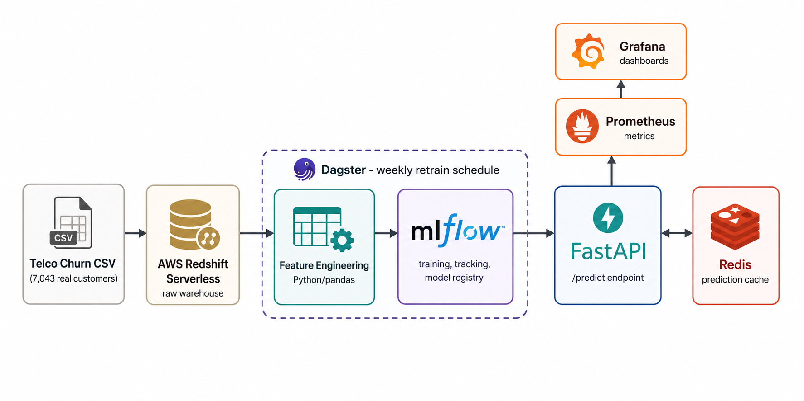

# Telco Customer Churn — ML Pipeline with Serving & Monitoring

An end-to-end ML pipeline predicting customer churn: Redshift Serverless
warehouse, MLflow experiment tracking and model registry, a FastAPI serving
layer with Redis-cached predictions, and Prometheus/Grafana monitoring. The
portfolio's first project bridging data engineering into MLOps.

## Why this project

- **The full loop, not just a notebook.** Ingestion → feature engineering →
  MLflow-tracked training → model registry → real-time serving →
  monitoring. Most churn-prediction portfolio projects stop at a Jupyter
  notebook with a printed accuracy score; this one actually serves the
  model behind an API with caching and observability.
- **Redis caching that's load-bearing, not decorative.** Predictions are
  cached by a hash of the input features - a repeat request for the same
  customer profile returns instantly from cache instead of re-running
  inference every time.
- **Prometheus + Grafana monitoring** on the serving layer via
  `prometheus-fastapi-instrumentator` - request latency, error rate, and
  throughput are observable out of the box, not bolted on after the fact.
- **A real, well-documented messy dataset**, handled explicitly: the
  famous `TotalCharges` blank-string bug (11 brand-new customers with
  `tenure=0` have no total charges yet - filled with 0, not dropped) is
  called out and fixed in `src/features.py`, not glossed over.
- **A real bug caught and fixed during development, not simulated for this
  README**: the trained model's `StandardScaler` was logged to MLflow but
  never actually loaded or applied at inference time - predictions were
  silently wrong (not erroring, just wrong) until this was caught by
  testing the model against a known high-risk vs. low-risk customer
  profile and noticing the output didn't move in the expected direction.

## Model performance

Logistic regression (chosen over more complex models because churn in this
dataset is largely linearly separable by contract type and tenure -
published independent analyses of this same dataset reach the same
conclusion):

| Metric | Value |
|---|---|
| ROC-AUC | 0.841 |
| Accuracy | 0.740 |
| Precision | 0.506 |
| Recall | 0.783 |
| F1 | 0.615 |

(Recall is prioritized via `class_weight="balanced"` - for a churn model,
missing an at-risk customer is more costly than a false alarm.)

## Architecture




</details>

## Evidence

Screenshots proving this runs end-to-end against real infrastructure with
the real 7,043-customer dataset, not just written but never executed:

| | |
|---|---|
|  | `terraform apply` provisioning Redshift Serverless |
|  | Real training run: ROC-AUC 0.841, model registered in MLflow |
|  | The registered model + scaler in the MLflow UI |
|  | Real predictions: high-risk profile (52.8%) vs. low-risk profile (2.5%) |
|  | A repeated request served from cache (`cached: true`) |
|  | Prometheus successfully scraping the API's `/metrics` endpoint |
|  | A Grafana dashboard built on the scraped metrics |
|  | Full test suite passing (11 tests) |

## Dataset

[IBM Telco Customer Churn](https://community.ibm.com/community/user/businessanalytics/blogs/steven-macko/2019/07/11/telco-customer-churn-1113)
(7,043 customers, 21 features) - a widely-used, freely-redistributable
dataset for churn prediction, originally from IBM's sample data sets,
commonly mirrored via Kaggle.

## Stack

| Layer | Tool |
|---|---|
| Warehouse | AWS Redshift Serverless |
| Feature engineering | Python / pandas |
| Model | scikit-learn (Logistic Regression) |
| Experiment tracking & registry | MLflow |
| Serving | FastAPI |
| Caching | Redis |
| Monitoring | Prometheus + Grafana |
| Orchestration | Dagster |
| IaC | Terraform |
| CI | GitHub Actions (pytest + terraform validate) |

## Repo structure

```
├── terraform/                 # Redshift Serverless namespace + workgroup + security group
├── src/
│   ├── ingest.py              # Loads raw CSV into Redshift
│   ├── features.py            # Cleans data, handles TotalCharges blank-string bug
│   └── train.py                # Trains + MLflow-tracks the model
├── serving/
│   └── api.py                  # FastAPI /predict endpoint, Redis caching, Prometheus metrics
├── dagster_project/
│   └── definitions.py          # raw_churn_data -> churn_model assets, weekly retrain schedule
├── tests/
│   ├── test_features.py        # Feature engineering tests (real data + synthetic edge cases)
│   └── test_api.py              # API tests: health, prediction sanity, caching, metrics
├── Dockerfile                   # Serving API container
├── docker-compose.yml            # API + Redis + Prometheus + Grafana
├── prometheus.yml                 # Scrape config
└── .github/workflows/ci.yml
```

## Running it

### 1. Provision Redshift Serverless

```bash
cd terraform
cp terraform.tfvars.example terraform.tfvars
# edit terraform.tfvars: set allowed_cidr to `curl -s ifconfig.me`/32

export TF_VAR_admin_password="choose-a-strong-password"

terraform init
terraform plan
terraform apply
```

### 2. Train the model

```bash
pip install -r requirements.txt
cd src
python ingest.py    # requires REDSHIFT_CONN_STRING env var set from terraform output
python train.py     # trains locally against the CSV, tracked in MLflow
```

### 3. Serve it

```bash
docker compose up --build
```
- API: http://localhost:8000/docs (interactive Swagger UI)
- Prometheus: http://localhost:9090
- Grafana: http://localhost:3001 (admin/admin)

### 4. Or orchestrate with Dagster

```bash
pip install dagster dagster-webserver
dagster dev -f dagster_project/definitions.py
```

### 5. Tests

```bash
pytest tests/ -v
```

## Tearing down

```bash
cd terraform
terraform destroy
```

## What I'd add with more time

- A proper feature store instead of computing features inline at request time
- A/B testing between model versions via MLflow's model stage transitions
- Grafana alerting rules on prediction latency and error rate

## Issues Encountered & Fixes

Two real bugs found and fixed during development, not simulated for this README:

<details>
<summary><strong>1. FastAPI's model-loading startup hook never fired</strong></summary>

**Symptom:** `/health` returned `model_loaded: false` even though the
startup code looked correct.

**Cause:** `@app.on_event("startup")` is a deprecated FastAPI API, and it
doesn't reliably fire in some contexts - including when `TestClient` is
used without a `with` context manager, which is exactly how it was first
tested.

**Fix:** switched to the modern `lifespan` context manager pattern, which
fires reliably regardless of how the app is instantiated or tested.
</details>

<details>
<summary><strong>2. Silent wrong predictions: the scaler was never applied</strong></summary>

**This is the more serious one.** The model was trained on
`StandardScaler`-scaled features, and the scaler was dutifully logged to
MLflow as a separate artifact - but the serving code never actually
*loaded or applied* it before calling `predict_proba()`. The API didn't
error. It just silently returned wrong predictions on unscaled data.

**How it was caught:** not by a crash, but by testing two deliberately
distinct customer profiles - one classic high-churn-risk (new customer,
month-to-month, fiber optic, no add-ons) and one classic low-risk (60-month
tenure, two-year contract, many add-ons) - and noticing the predicted
probabilities didn't move in the direction they obviously should have.

**Fix:** loaded the scaler from the same MLflow run as the model, and
applied `scaler.transform(X)` before every prediction. After the fix, the
high-risk profile scored 52.8% churn probability and the low-risk profile
scored 2.5% - the model finally behaved the way the data says it should.

**The lesson:** a model that runs without erroring is not the same as a
model that's correct. This one needed a *behavioral* sanity check, not
just a successful HTTP response, to catch it.
</details>

---
*Part of a modernized 10-project data engineering portfolio, upgrading the
original brief from [garage-education/data-engineering-projects](https://github.com/garage-education/data-engineering-projects).*
